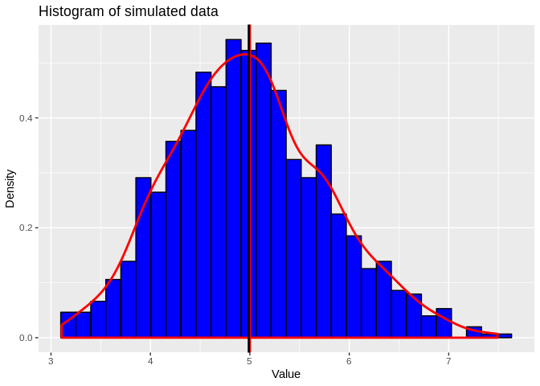

Statisic inference - Assignment1 part1
================
Simon Baumgart
May 25, 2019

Part I - Compare the simulated exponential distribution to the theoretical value with the Central Limit Theorem
===============================================================================================================

Introduction
------------

In this first part of the assignment within the "Statistical Inference" Coursera course a dataset will be simulated and compared to its theoretical mean and variance. The simulated distribution will be compared graphically and by t.test. Detailed instructions and guide lines can be found here: [assignment 1 - statistical inference - coursera](https://www.coursera.org/learn/statistical-inference/peer/3k8j5/statistical-inference-course-project)

brief summary:
The mean of the exponential distribution is 1/lambda
Labmda is 0.2
40 exponentials are used to build one data point
thousand simulations will be run in total

simulation of the data
----------------------

``` r
set.seed(1)
mns_1000 <- c()
for(i in 1:1000){
    mns <- mean(rexp(n = 40,rate = 0.2))
    mns_1000 <- c(mns_1000, mns)
}

simMn <- mean(mns_1000)
varMn <- var(mns_1000)
```

theoretical mean and variance
-----------------------------

``` r
theoMn <- 1/0.2
theoVar <- (1/0.2)^2 /40
```

comparison of simulated and theoretical data
--------------------------------------------

``` r
library(ggplot2)
gplot <- data.frame(mns_1000)
m <- ggplot(gplot, aes(x = mns_1000)) + xlab("simulated mean")
m <- m + geom_histogram(aes(y=..density..), colour = "black", fill = "blue")
m + geom_density(colour = "red", size = 1) + geom_vline(xintercept = theoMn, color = "red", size =1) + geom_vline(xintercept = simMn, color = "black", size =1) + ggtitle("Histogram of simulated data") +  xlab("Value") + ylab("Density")
```



The data we generated follows a approximate normal standard distribution as shown by the histogram and the density indicated by the red line overlaying the data. Further, the red and the black line indicating the theoretical mean (red) and the mean of the simulated data (black) are almost overlaying.

statistical comparison between the theoretical and the simulated values
-----------------------------------------------------------------------

### 95% conf interval

``` r
simConfIntervl <- round( simMn + c(-1,+1) * 1.96 * sd(mns_1000)/sqrt(40),3)
theoretiConfIntervl <- round(theoMn + c(-1,+1) * 1.96 * theoVar/sqrt(40),3)

simConfIntervl
```

    ## [1] 4.748 5.232

``` r
theoretiConfIntervl
```

    ## [1] 4.806 5.194

The two 95% confidence intervals of the simulated (first value) and the theoretical values are compareable and close to each other.

### norml distribution

``` r
qqnorm(mns_1000)
qqline(mns_1000)
```


Finally, the correlation of the theoretical quantiles of a normal distribution with the quantiles we observe in our generated data gives us good support that data we generated is normally distributed.
