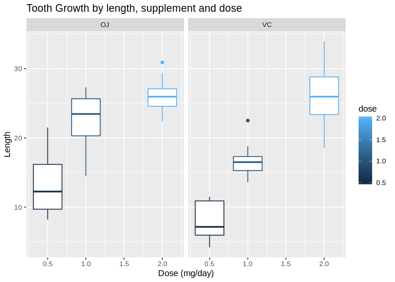

Statisic Inference - Assignment 1 part II
================
Simon Baumgart
May 26, 2019

part II - Analysis of the tooth growth dataset
============================================

Introduction
------------

The data set "ToothGrowth" is analyzed within this document to explore the effect of vitamine C on the length of the odontoblasts. Briefly, guinea pigs are get different doses (0.5, 1, 2 mg/day) of either orange juice (OJ) or vitamine C (VC) over an unknown timeframe. The length of the odontoblasts is then compared between each group. 

Explanations about the dataset are here:
[ToothGrowth dataset](https://stat.ethz.ch/R-manual/R-devel/library/datasets/html/ToothGrowth.html)


### loading of the data

``` r
data(ToothGrowth)
```

exploration of the dataset
--------------------------

``` r
head(ToothGrowth)
```

    ##    len supp dose
    ## 1  4.2   VC  0.5
    ## 2 11.5   VC  0.5
    ## 3  7.3   VC  0.5
    ## 4  5.8   VC  0.5
    ## 5  6.4   VC  0.5
    ## 6 10.0   VC  0.5

``` r
str(ToothGrowth)
```

    ## 'data.frame':    60 obs. of  3 variables:
    ##  $ len : num  4.2 11.5 7.3 5.8 6.4 10 11.2 11.2 5.2 7 ...
    ##  $ supp: Factor w/ 2 levels "OJ","VC": 2 2 2 2 2 2 2 2 2 2 ...
    ##  $ dose: num  0.5 0.5 0.5 0.5 0.5 0.5 0.5 0.5 0.5 0.5 ...

``` r
summary(ToothGrowth)
```

    ##       len        supp         dose      
    ##  Min.   : 4.20   OJ:30   Min.   :0.500  
    ##  1st Qu.:13.07   VC:30   1st Qu.:0.500  
    ##  Median :19.25           Median :1.000  
    ##  Mean   :18.81           Mean   :1.167  
    ##  3rd Qu.:25.27           3rd Qu.:2.000  
    ##  Max.   :33.90           Max.   :2.000

``` r
table(ToothGrowth$supp, ToothGrowth$dose)
```

    ##     
    ##      0.5  1  2
    ##   OJ  10 10 10
    ##   VC  10 10 10

plotting of the data
--------------------

``` r
library("dplyr")
library("ggplot2")
data("ToothGrowth")


df_means_OJ <- ToothGrowth %>% filter(supp == "OJ") %>% group_by(dose) %>% summarise(value=mean(len)) %>% mutate(supp = "OJ")
df_means_VC <- ToothGrowth %>% filter(supp == "VC") %>% group_by(dose) %>% summarise(value=mean(len)) %>% mutate(supp ="VC")

df_merged <- rbind(df_means_OJ, df_means_VC)

ggplot(data = ToothGrowth , aes(x = dose,y = len, group = dose, col = dose)) + 
    geom_boxplot() + facet_grid(.~supp)  + ggtitle("Tooth Growth by length, supplement and dose") +  xlab("Dose (mg/day)") + ylab("Length")
```



This plot already shows that there is a dose response for the length of odontoblasts in both groups. If those are statistically relevant needs to be validated.

statistic comparison between supplements and doses
--------------------------------------------------

The boxplot indicate that there are differences between the median of the different doses within the different treatment groups. However, it is not clear if - the differecens which we see are significant - the differences between the different treatments are significant

Therefore, the next lines will analyse exactly those differences:

compare the significance between the doses within the orange juice group

``` r
OJ_05 <- ToothGrowth %>% filter(supp == "OJ") %>% filter(dose == 0.5) %>% select(len)
OJ_1 <- ToothGrowth %>% filter(supp == "OJ") %>% filter(dose == 1) %>% select(len)
OJ_2 <- ToothGrowth %>% filter(supp == "OJ") %>% filter(dose == 2) %>% select(len)
```

``` r
t.test(OJ_05, OJ_1, paired = F, var.equal = F)
```

    ## 
    ##  Welch Two Sample t-test
    ## 
    ## data:  OJ_05 and OJ_1
    ## t = -5.0486, df = 17.698, p-value = 8.785e-05
    ## alternative hypothesis: true difference in means is not equal to 0
    ## 95 percent confidence interval:
    ##  -13.415634  -5.524366
    ## sample estimates:
    ## mean of x mean of y 
    ##     13.23     22.70

``` r
t.test(OJ_1, OJ_2, paired = F, var.equal = F)
```

    ## 
    ##  Welch Two Sample t-test
    ## 
    ## data:  OJ_1 and OJ_2
    ## t = -2.2478, df = 15.842, p-value = 0.0392
    ## alternative hypothesis: true difference in means is not equal to 0
    ## 95 percent confidence interval:
    ##  -6.5314425 -0.1885575
    ## sample estimates:
    ## mean of x mean of y 
    ##     22.70     26.06

Both comparisons show that the comparison to the next higher dose is significant and that we can reject the NULL-Hypothesis that with the treatment there is no difference. We can further say that it is likely that with the higher dosing of orange juice in this given experiment the length of the odontoblasts are increased.

Next we do the same analysis with for the vitamine C group:

``` r
VC_05 <- ToothGrowth %>% filter(supp == "VC") %>% filter(dose == 0.5) %>% select(len)
VC_1 <- ToothGrowth %>% filter(supp == "VC") %>% filter(dose == 1) %>% select(len)
VC_2 <- ToothGrowth %>% filter(supp == "VC") %>% filter(dose == 2) %>% select(len)
```

``` r
t.test(VC_05, VC_1, paired = F, var.equal = F)
```

    ## 
    ##  Welch Two Sample t-test
    ## 
    ## data:  VC_05 and VC_1
    ## t = -7.4634, df = 17.862, p-value = 6.811e-07
    ## alternative hypothesis: true difference in means is not equal to 0
    ## 95 percent confidence interval:
    ##  -11.265712  -6.314288
    ## sample estimates:
    ## mean of x mean of y 
    ##      7.98     16.77

``` r
t.test(VC_1, VC_2, paired = F, var.equal = F)
```

    ## 
    ##  Welch Two Sample t-test
    ## 
    ## data:  VC_1 and VC_2
    ## t = -5.4698, df = 13.6, p-value = 9.156e-05
    ## alternative hypothesis: true difference in means is not equal to 0
    ## 95 percent confidence interval:
    ##  -13.054267  -5.685733
    ## sample estimates:
    ## mean of x mean of y 
    ##     16.77     26.14

We can conclude that with the higher dosing of vitamine C there is a significant increase of the tooth length, similarly to the orange juice supplemented group.

Finally, the treatments will be compared if orange juice has a similar effect like vitamine c supplement or if there is a difference

``` r
t.test(VC_05, OJ_05, paired = F, var.equal = F)
```

    ## 
    ##  Welch Two Sample t-test
    ## 
    ## data:  VC_05 and OJ_05
    ## t = -3.1697, df = 14.969, p-value = 0.006359
    ## alternative hypothesis: true difference in means is not equal to 0
    ## 95 percent confidence interval:
    ##  -8.780943 -1.719057
    ## sample estimates:
    ## mean of x mean of y 
    ##      7.98     13.23

``` r
t.test(VC_1, OJ_1, paired = F, var.equal = F)
```

    ## 
    ##  Welch Two Sample t-test
    ## 
    ## data:  VC_1 and OJ_1
    ## t = -4.0328, df = 15.358, p-value = 0.001038
    ## alternative hypothesis: true difference in means is not equal to 0
    ## 95 percent confidence interval:
    ##  -9.057852 -2.802148
    ## sample estimates:
    ## mean of x mean of y 
    ##     16.77     22.70

``` r
t.test(VC_2, OJ_2, paired = F, var.equal = F)
```

    ## 
    ##  Welch Two Sample t-test
    ## 
    ## data:  VC_2 and OJ_2
    ## t = 0.046136, df = 14.04, p-value = 0.9639
    ## alternative hypothesis: true difference in means is not equal to 0
    ## 95 percent confidence interval:
    ##  -3.63807  3.79807
    ## sample estimates:
    ## mean of x mean of y 
    ##     26.14     26.06

conclusion
----------

With these comparison we can conclude that **there are differences between the length of teeth when supplementing with vitamine C or orange juice**. The differences are between the dosing of 0.5 and 1 mg/day. However, there are **no differences to the lower dosed groups when dosing either with vitamine C or orange juice with 2mg/ day** on the growth of the odontoblasts of guinea pigs. It would be however interesting to compare those groups to non-treated groups to see how the base level is. Further, it might be interesting to see if those treatments can be compared to human teeth grows in some way.
